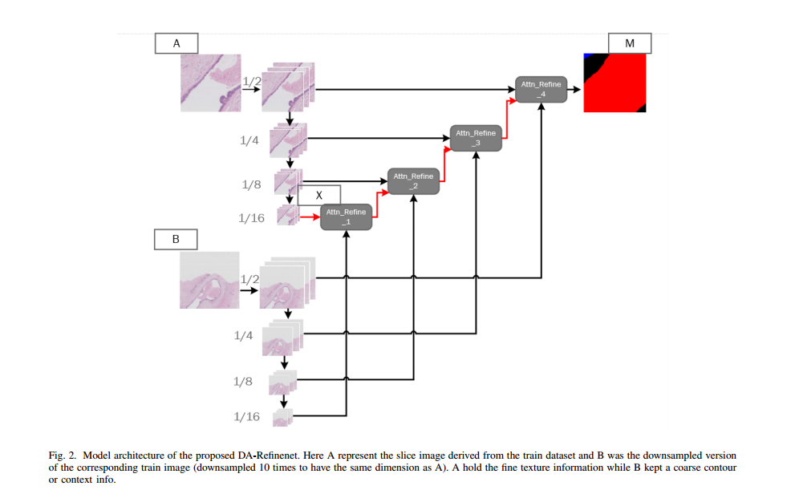

# DA-Refinenet
we proposes a dual input semantic segmentation network for WSI based on attention

 the paper's address :https://arxiv.org/abs/1907.06358

Abstract—Due to the high resolution of pathological images,
the automated semantic segmentation in the medical pathological
images has shown greater challenges than that in natural images.
Sliding Window method has shown its effect on solving problem
caused by the high resolution of whole slide images (WSI).
However, owing to its localization, Sliding Window method also
suffers from lack of global information. In this paper, a dual input
semantic segmentation network based on attention is proposed,
in which, one input provides small-scale fine information, the
other input provides large-scale coarse information. Compared
with single input methods, our method based on dual inputs
and attention: DA-RefineNet exhibits a dramatic performance

---
## Overview
### Data
The original dataset is from [ICIAR2018 challenge](https://iciar2018-challenge.grand-challenge.org/). The
dataset is composed of Hematoxylin and eosin (H&E), stained
breast histology microscopy, and whole-slide images. we only use the whole slide image. This part contains 10 whole slide images. Whole-slide images are
high resolution images containing the entire sampled tissue.
In this sense, microscopy images just served as details of
the whole-slide images. Because of that, each whole-slide
image could have multiple normal, benign, in situ carcinoma
and invasive carcinoma regions.

### Data pre-processing
The whole slide image is very big, so we need to use sliding windows. Firstly, we use the sliding window to cut the whole slide image into 5000*5000 pixel images which provide large-scale coarse contextual information. Secondly, we use the sliding window with a size of 1000*1000 and a step size of 500 pixels to cut the 5000*5000 pixel images imto 1000*1000 pixel images which provide small-scale fine localited information. Thirdly, we resize both images to 500*500 pixels. Finally, we use data screening to balance the four types of data to a certain extent.
### Model

